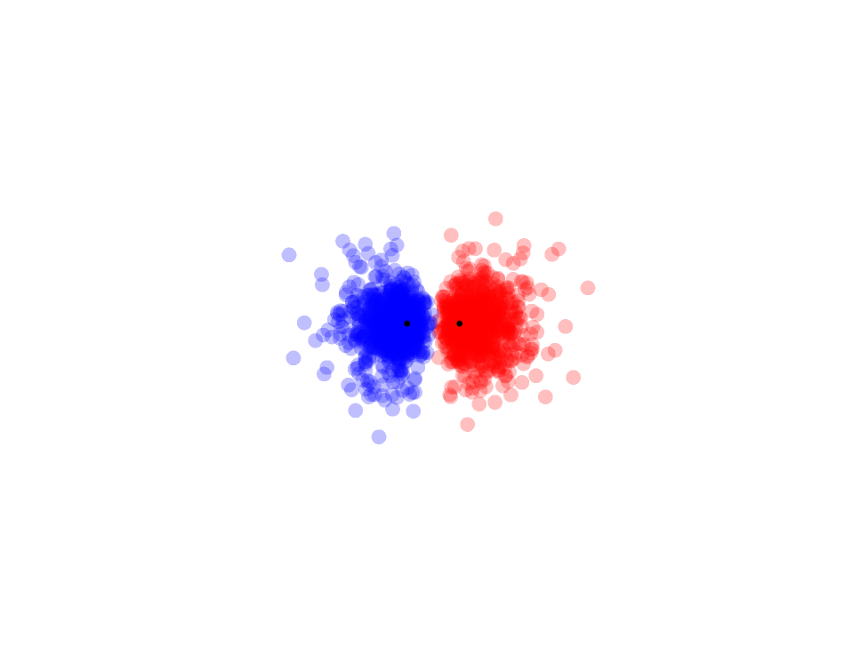
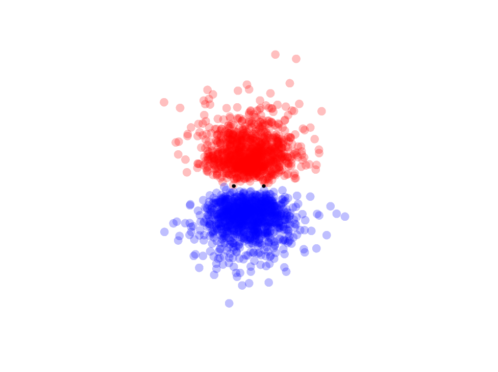
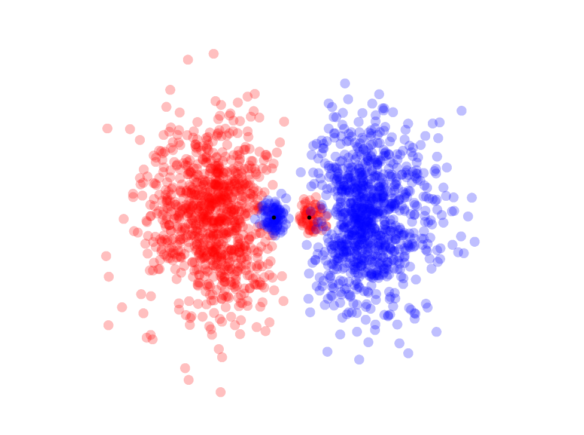
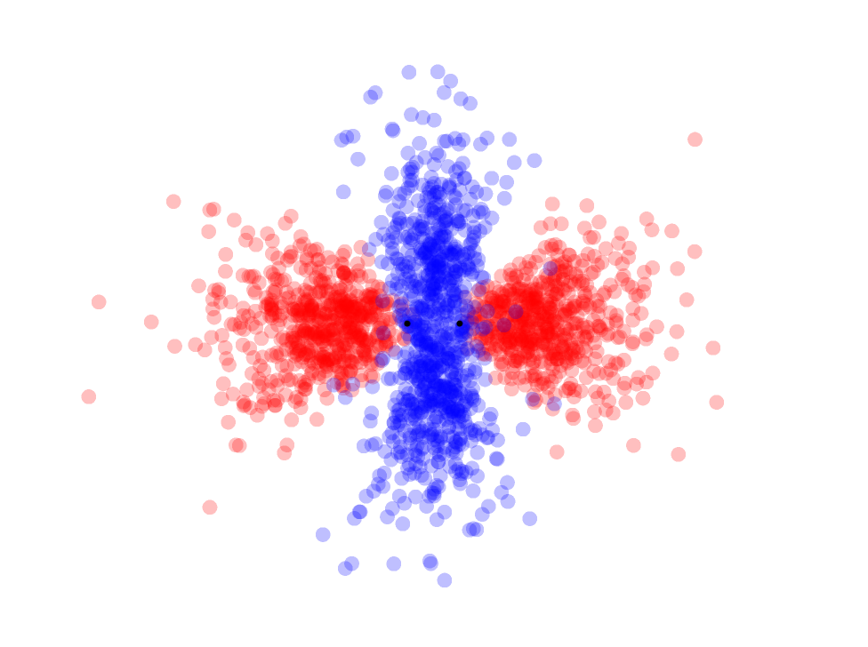
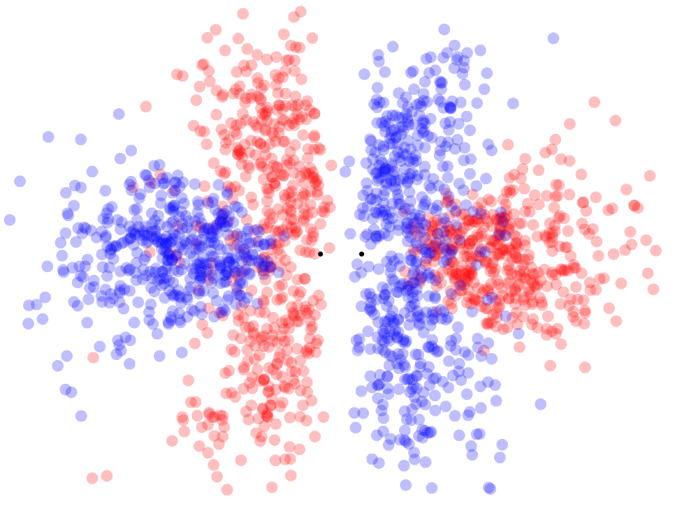

# hydrogen-molecular-ion
### Introduction

This Jupyter Notebook is a guide through obtaining the molecular orbitals of the quantum system of H2+ by directly solving the Schrödinger equation, using Python (with modules such as NumPy and SciPy). This work is derived from the following resources.

- Grivet, J.-P. The Hydrogen Molecular Ion Revisited. Journal of Chemical Education, 2002, 79, 127. https://doi.org/10.1021/ed079p127.
- Johnson, J. L. Visualization of Wavefunctions of the Ionized Hydrogen Molecule. Journal of Chemical Education, 2004, 81, 1535. https://doi.org/10.1021/ed081p1535.1.

### Examples in this notebook

Here is a graph of the electronic energy of each molecular orbital, plotted against the internuclear distance.

Here is another graph of the total energy of each molecular orbital, plotted against the internuclear distance.

Comparison between the molecular orbitals obtained in this series of notebooks with the LCAO-MOs.

Another comparison between the same molecular orbitals, evaluated along the internuclear axis.

A contour plot of the bonding and antibonding molecular orbitals.

The computed molecular orbitals, visualized.

- Scatterplots

| 1σg | 1σu* | 
|:-:|:-:|
|  |  |

| 1πu | 2σg |
|:-:|:-:|
|  |  |

| 2σu* | 3σg | 
|:-:|:-:|
|  |  |

| 1πg* | 3σu* |
|:-:|:-:|
|  |  |

- Isosurfaces

| 1σg | 1σu* | 
|:-:|:-:|
|  |  |

| 1πu | 2σg |
|:-:|:-:|
|  |  |

| 2σu* | 3σg |  
|:-:|:-:|
|  |  |

| 1πg* | 3σu* |
|:-:|:-:|
|  |  |

### Python information
The following modules are *required*.

- NumPy
- SciPy for solving differential equations
- Matplotlib for 2D graphing

Other modules used are

- Plotly for 3D graphing (required for viewing 3D plots, images of which are already generated)
- scikit-image (for generating 3D meshes, which are already generated)

### How this is organized

The `.ipynb` notebooks, numbered 1, 2, 3a, 3b, and 4, is the main course. Read through these notebooks to gain a thorough understanding of the hydrogen molecular ion. 

In fact, the rest of the files are for convenience, and they are not necessary. The python files `plot_scatterplot.py` and `plot_isosurface.py` respectively draws the 3D scatterplot and the 3D mesh plot of the molecular orbitals. The `data` file contains data that is used frequently in the notebooks - this is explained in the notebook as needed. It also contains data for drawing the 3D scatterplot and 3D mesh plot of the molecular orbitals, as well as the python scripts used to generate such data.

### Contact Information

You can contact me at KeroseneNotForConsumption@gmail.com
